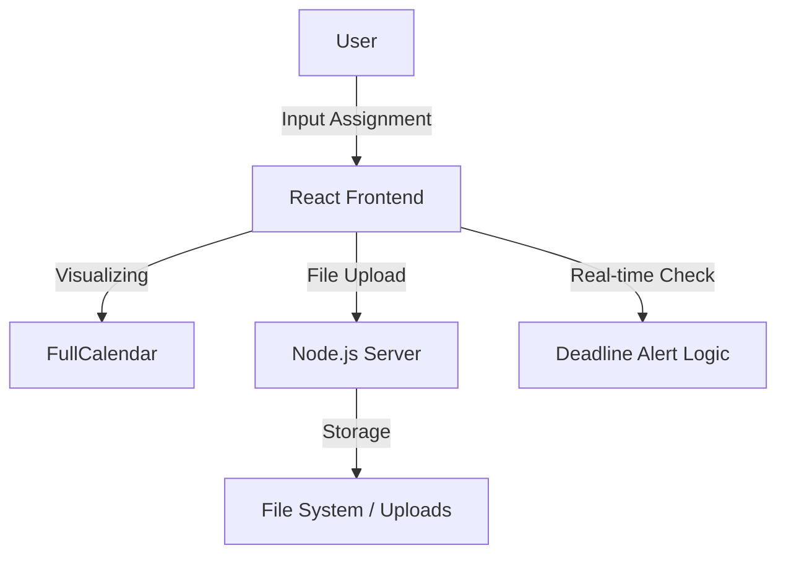

# 📝 과제 관리 매니저 (Assignment Manager)


> **"대학생을 위한 스마트한 과제 및 일정 관리 솔루션"**
> <br/>React와 Node.js를 활용하여 과제 마감 임박 알림, 일정 시각화, 시간표 관리 기능을 제공하는 웹 애플리케이션

<br/>

## 📸 프로젝트 시연 (Demo)


<br/>


## 🛠 시스템 구조 (Architecture)



<br/> 

## 📌 주요 기능 (Key Features)

* **📝 과제 CRUD 및 파일 업로드**
    * `FormData`를 활용하여 과제 제목, 설명, 마감일뿐만 아니라 관련 파일(.pdf, .png 등)까지 서버로 전송 및 저장
    * 진행 중인 과제와 완료된 과제를 구분하여 대시보드에서 직관적으로 관리
* **⏰ 마감 임박 실시간 알림 (Real-time Alert)**
    * 과제 마감 시간이 **24시간 이내**로 남았을 경우, 시스템이 이를 감지하여 사용자에게 즉시 알림(Alert)을 띄워 놓침 방지
* **📅 일정 시각화 (Calendar Integration)**
    * **FullCalendar 라이브러리**를 연동하여 등록된 과제를 달력(`DayGrid`) 형태로 시각화
    * 완료 여부에 따라 색상(Green/Skyblue)을 다르게 표시하여 상태 파악 용이
* **📊 인터랙티브 시간표 관리**
    * 사용자가 직접 강의명과 시간을 입력하고 편집할 수 있는 주간 시간표 기능 구현
* **🔍 검색어 하이라이팅 (Search & Highlight)**
    * 과제 목록에서 키워드 검색 시, 일치하는 텍스트를 찾아 **노란색 형광펜 효과(`<mark>`)**를 실시간으로 적용

<br/>

## ⚡ 기술적 도전 및 해결 (Troubleshooting)

### 1. 마감 임박 자동 감지 로직 (Real-time Deadline Check)
* **Issue:** 사용자가 별도로 새로고침하지 않아도, 마감 시간이 24시간 안으로 들어오는 순간 알림을 줘야 함
* **Solution:** `useEffect`와 `setInterval`을 활용하여 30초마다 남은 시간을 백그라운드에서 계산하고, 조건 충족 시 알림 상태를 업데이트하는 로직 구현

```javascript
// 마감 임박 과제 알림 로직 (30초 주기 체크)
useEffect(() => {
    const checkDeadlines = () => {
        const now = new Date();
        const updatedTasks = tasks.map((task) => {
            const timeDifference = new Date(task.deadline) - now;
            // 24시간 이내(86400000ms) && 미완료 && 알림 미발송 상태 체크
            if (timeDifference > 0 && timeDifference <= 24 * 60 * 60 * 1000 && !task.notified && !task.completed) {
                alert(`마감 임박! 과제: ${task.title}`);
                return { ...task, notified: true }; // 알림 중복 방지
            }
            return task;
        });
        setTasks(updatedTasks);
    };
    const interval = setInterval(checkDeadlines, 30000); 
    return () => clearInterval(interval); // 메모리 누수 방지
}, [tasks]);
```

### 2. 검색어 하이라이팅 처리 (Regex Highlighting)
* **Issue:** 검색 결과에서 단순히 필터링만 하는 것이 아니라, 어떤 단어가 매칭되었는지 시각적으로 보여줘야 함
* **Solution:** 정규표현식(`RegExp`)을 사용하여 대소문자 구분 없이 검색어와 일치하는 부분을 찾아 `<mark>` 태그로 감싸는 변환 함수 구현

```javascript
// 검색어 하이라이트 함수
const highlightText = (text, query) => {
    if (!query) return text;
    // gi: global match, case-insensitive
    const regex = new RegExp(`(${query})`, "gi"); 
    return text.replace(regex, "<mark>$1</mark>");
};
```
<br/>

## ⚙️ 기술 스택 (Tech Stack)

| Category | Technology |
|---|---|
| **Frontend** | React.js, JavaScript (ES6+), HTML5, CSS3 |
| **Backend** | Node.js, Express |
| **Library** | FullCalendar, Multer (File Upload) |
| **Tools** | Git, VS Code |
